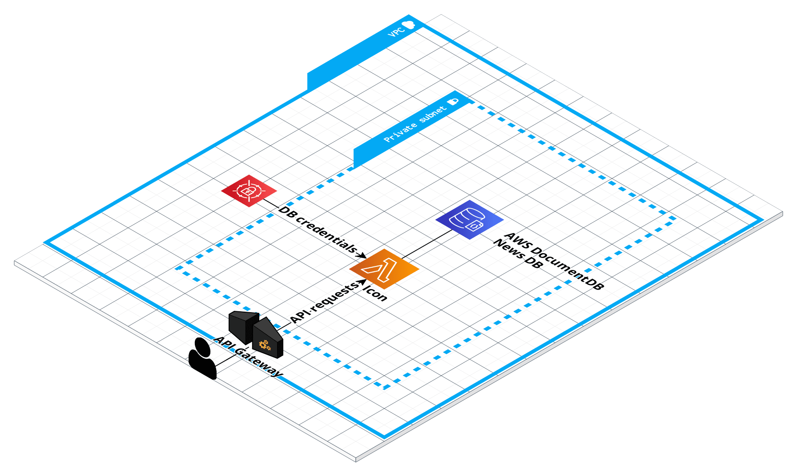

# AWS Lambda CRUD project

This is a simple project implementing CRUD operations and storing data in DocumentDB

## Components

- AWS Lambda
- API Gateway
- Github Actions with SAM pipeline 
- DocumentDB
- Secret Manager with credentials for DB




## Dependencies

To use the SAM CLI, you need the following tools.

* SAM CLI - [Install the SAM CLI](https://docs.aws.amazon.com/serverless-application-model/latest/developerguide/serverless-sam-cli-install.html)
* [Python 3 installed](https://www.python.org/downloads/)
* Docker - [Install Docker community edition](https://hub.docker.com/search/?type=edition&offering=community)

## Use the SAM CLI to build and test locally

Build application
```bash
sam build --use-container
```

Run:
```bash
sam local start-api --region eu-west-2
```

or invoke events manually:

```bash
sam local invoke NewsCRUDFunction --event events/event_get.json
sam local invoke NewsCRUDFunction --event events/event_post.json
```
